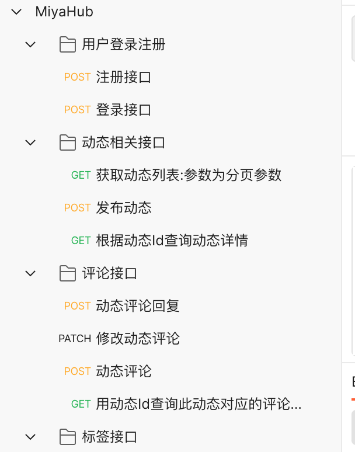

# MiyaHub

> koa实现：评论管理后台
>
> 有了这个你还需要看后端的脸色吗
>
> 写这个的初衷：回顾node技术栈，为啥用KOA而不用Express,因为Express不能很好的处理异步函数，而KOA在处理异步函数时具有天生的优势，因为KOA的源码再处理中间件时，是通过dispatch调用的 而dispatch内部则是Promsie。另外此项目不包含展示页面，接口调用成功 直接看数据库就行了 相信各位大佬 都能自己实现绚丽的前端页面
>
>   

## 掘金

> 此项目的详细在掘金，地址：
>
> https://juejin.cn/post/7008418805428781063

## 技术栈

> KOA、dotenv、jsonwebtoken、koa-bodyparser、koa-router、mysql2、jimp

## 项目特点

> - 用户注册时，对password进行MD5加盐加密 可以直接移植到真实项目中
> - 前端工程化：项目中的动态参数都写在了.env文件，项目结构代码完全按照前端开发规范编写
> - 实现了JWT，可以直接移植到实际的开发中
>   - 在我们的实际场景业务开发中，我们也是通过token验证人员，
> - 单文件上传
> - 多文件上传
> - 图片自动裁剪

## 项目业务流程

> - 用户注册
> - 用户添加头像
> - 用户登录： 用户登录成功后，会返回此用户的用户名、密码、token
>   - 在后续的业务流程中，需要携带此token
> - 发表动态
>   - 将token放到header中Authorization字段中
> - 动态添加配图
> - 对发表的动态进行评论
> - 对评论编辑
> - 对评论的删除
> - 创建标签页

## JWT

> 执行登录之后的业务场景时需要携带token
>
> 

## 构建步骤 

> ### 本地创建Mysql数据库，版本无所谓
>
> ### 将sql文件夹中beans_flight.sql建表语句插入到数据库中
>
> ### 修改根目录下的.env 数据库配置文件

## 启动项目

> npm run start 或者 yarn start

## API接口

> 将工程内的根目录文件夹下的`apiscript`直接拷贝到postman中 可以看到完整的接口
>
> 

## 阿里云部署

> 自己购买服务器，然后通过terminal远程连接自己的云服务器
>
> ```shell
> ssh root@47.93.34.95  // ip为云服务器的公网地址
> ```
>
> 然后填写密码

### DNF包管理工具安装NodeJS

> 检查dnf是否可用
>
> ```shell
> dnf --help
> ```
>
> 查看NodeJS是否能被安装
>
> ```shell
> dnf search nodejs
> ```
>
> 如果想详细看下包的信息
>
> ```shell
> dnf info nodejs
> ```
>
> 安装nodejs, 有dnf上的nodejs版本太低了 之后我们还需要安装node的版本管理工具:n
>
> ```shell
> dnf install nodejs
> ```
>
> ```shell
> npm i -g n
> ```
>
> 然后安装最近版本的node
>
> ```shell
> n install lts
> n install latest
> ```
>
> 然后通过n切换版本
>
> ```shell
> n
> ```
>
> 

### DNF包管理工具安装MySQL-Server

> 查找MySQL
>
> ```shell
> dnf search mysql-server
> ```
>
> 查看
>
> ```shell
> dnf info mysql-server
> ```
>
> 安装
>
> ```shell
> dnf install mysql-server	
> ```
>
> 安装成功之后需要启动mysql服务
>
> Active: **active (running)** 表示启动成功
>
> ```shell
> // system control -> systemctl
> systemctl start mysqld
> //查看mysql服务 active表示启动成功
> systemctl status mysqld
> //随着系统一起启动
> systemctl enable mysqld
> ```
>
>
> 由于通过命令行安装是不会设置账号密码 所以需要如下步骤单独设置mysql账号密码
>
> ```shell
> mysql_secure_installation
> //设置的过程中一定要注意运行远程连接
> //设置成功后 在命令行输入查看是否能进入mysql
> mysql -u root -p
> ```
>
> 阿里云服务器开放3306端口
>
> 实例->安全组->配置规则->快速添加
>
> 
>
> 更新user表开启远程访问
>
> update user set host = '%' where user = 'root';
>
> 然后执行刷新
>
> flush privileges;
>
> 如果产生because of many connection errors，则清理
>
> flush hosts;

### 安装Git

> 安装Git
>
> ```shell
> dnf search git
> ```

### Git Clone 项目

> 从gitHub上拉取项目
>
> ```
> git clone 项目地址
> ```
>
> 

## pm2启动node程序

> 通过终端启动的node程序，那么如果终端关闭掉了呢
>
> - 那么这个是相当于启动的Node进程会被关闭
> - 我们将无法继续访问服务器
>
> PM2是一个Node的进程管理器，可以使用它来管理Node的后台进程 在于在关闭终端时，Node进程会继续执行

### CenterOS 安装PM2

> 全局安装
>
> ```shell
> npm i pm2 -g
> ```
>
> 

### PM2常用命令

> pm2 start app.js # 启动app.js应用程序
>
> $ pm2 start app.js -i 4    ###  cluster mode 模式启动4个app.js的应用实例 可以设置负载均衡
>
> \# 4个应用程序会自动进行负载均衡
>
> $ pm2 start app.js --name="api" # 启动应用程序并命名为 "api"
>
> $ pm2 start app.js --watch   # 当文件变化时自动重启应用
>
> $ pm2 start script.sh     # 启动 bash 脚本
>
> $ pm2 list           # 列表 PM2 启动的所有的应用程序
>
> $ pm2 monit          # 显示每个应用程序的CPU和内存占用情况
>
> $ pm2 show [app-name]     # 显示应用程序的所有信息
>
> $ pm2 logs           # 显示所有应用程序的日志
>
> $ pm2 logs [app-name]     # 显示指定应用程序的日志
>
> $ pm2 flush            # 清空所有日志文件
>
> $ pm2 stop all         # 停止所有的应用程序
>
> $ pm2 stop 0          # 停止 id为 0的指定应用程序
>
> $ pm2 restart all       # 重启所有应用
>
> $ pm2 reload all        # 重启 cluster mode下的所有应用
>
> $ pm2 gracefulReload all    # Graceful reload all apps in cluster mode
>
> $ pm2 delete all        # 关闭并删除所有应用
>
> $ pm2 delete 0         # 删除指定应用 id 0
>
> $ pm2 scale api 10       # 把名字叫api的应用扩展到10个实例
>
> $ pm2 reset [app-name]     # 重置重启数量
>
> $ pm2 startup         # 创建开机自启动命令
>
> $ pm2 save           # 保存当前应用列表
>
> $ pm2 resurrect        # 重新加载保存的应用列表
>
> $ pm2 update          # Save processes, kill PM2 and restore processes
>
> $ pm2 generate         # Generate a sample json configuration file
>
> pm2文档地址：http://pm2.keymetrics.io/docs/usage/quick-start/

## jenkins自动化部署

> centerOS 安装JDK1.8
>
> ```shell
> dnf install java-1.8.0-openjdk
> ```
>
> 配置环境变量
>
> which java
>
> ls -lrt /usr/bin/java  //（也就是上一步查询出来的路径）
>
> 切换用户为root
>
> vi /etc/profile  
>
> 插入如下内容
>
> export JAVA_HOME=/usr/lib/jvm/java-1.8.0
> export JRE_HOME=$JAVA_HOME/jre  
> export PATH=$PATH:$JAVA_HOME/bin:$JRE_HOME/bin
> export CLASSPATH=.:$JAVA_HOME/lib/dt.jar:$JAVA_HOME/lib/tools.jar:$JRE_HOME/lib
>
> esc :wq

### Jenkins下载安装

> 启用Jenkins存储库。运行以下命令下载并导入GPG密钥：
>
> ```shell
> sudo wget -O /etc/yum.repos.d/jenkins.repo https://pkg.jenkins.io/redhat/jenkins.repo
> sudo rpm --import https://pkg.jenkins.io/redhat/jenkins.io.key
> ```
>
> 安装Jenkins
>
> ```shell
> dnf install denkins
> ```
>
> 安装成功后 启动Jenkins
>
> ```shell
> systemctl start jenkins
> #查看jenkins运行状态
> systemctl status jenkins
> ```
>
> JenKins默认启动在8080端口 我们需要设置阿里云的安全组配置
>
> 

